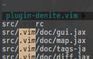
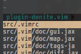

# denite.nvimのhighlight新オプション

[denite.nvim](https://github.com/Shougo/denite.nvim)

uniteが開発終了になりまして、deniteに割りとすぐさま移行したのですが一個悩みがありました。
検索して絞り込んでいく際に文字列がhighlightされるのですがschemeによってはえらーくみづらくなったのです。

# BEFORE



み、みづらい…
エンジニア的に目は命なので、やむを得ず相性の良い[gruvbox](https://github.com/morhetz/gruvbox)を使っていたりしたのですが、
deniteのrepositoryを覗いたら、新たなオプションが追加されていました

```
Q: I want to change the cursor line color in Denite buffer.

A: denite uses 'cursorline' feature.
So you can change the color by |hl-CursorLine| highlight or
|denite-options-highlight-mode-{mode}|. >
	Denite file_rec -highlight-mode-insert=Search

```

キタコレ！

さっそくmyvimrcに追加

```vim
nmap <silent> <Leader><Leader> :<C-u>Denite file_rec -highlight-mode-insert=Search<CR>

```


#AFTER



これこれ！これですよ！
これでまた新たなcolorscheme探しの旅を始められます。
ありがとうShougoさん。
