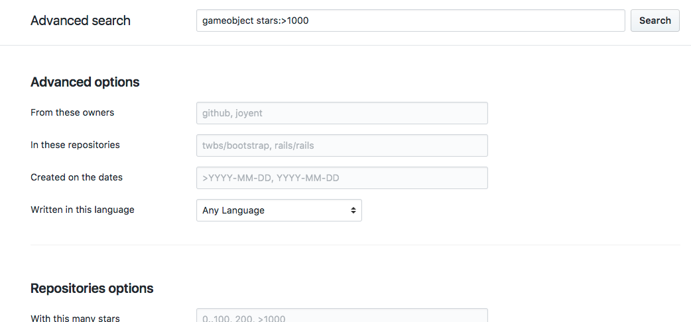

# いつものコード検索（Google検索）にひとひねり

今までの自分の流れはこんな感じでした…

AlfredのGoogle検索でぐぐる
↓
お！ちょうどやりたい実装に近いコードがあった！コピペコピペ

or

AlfredのGoogle検索でぐぐる
↓
お！stackoverflowに良いコードがある。コピペコピペ

or

AlfredのGoogle検索でぐぐる
↓
ない(´・ω・`)
↓
しゃーないドキュメント読もう…

上記の流れを客観的に見ると自分の三流っぷりが見えてきたアイタタタなのですが、
そんな自分でもひとつレベルアップできる調査（検索）のHowToがあります。
githubのadvanced検索です。

## 検索ボックスのオプション

- stars

`stars:>100 unity`

starが100よりもついているリポジトリをunityというワードで検索します

- language

`language:C# gameobject`

c#でgameobjectというワード検索します

- repo

`repo:neuecc/UniRX Micro`

user/repoのリポジトリ内でMicroというワードで検索します

- extension

`extension:cs IEnumerator`

拡張子がcsのファイルでIEnumeratorというワードで検索します

- path

`path:Scripts Observable`

ScriptsというディレクトリにあるファイルをObservableというワードで検索します

- user

`@neuecc extension`

neueccというユーザーのリポジトリでextensionというワードで検索します

## 実は…

GUIで指定できますw

